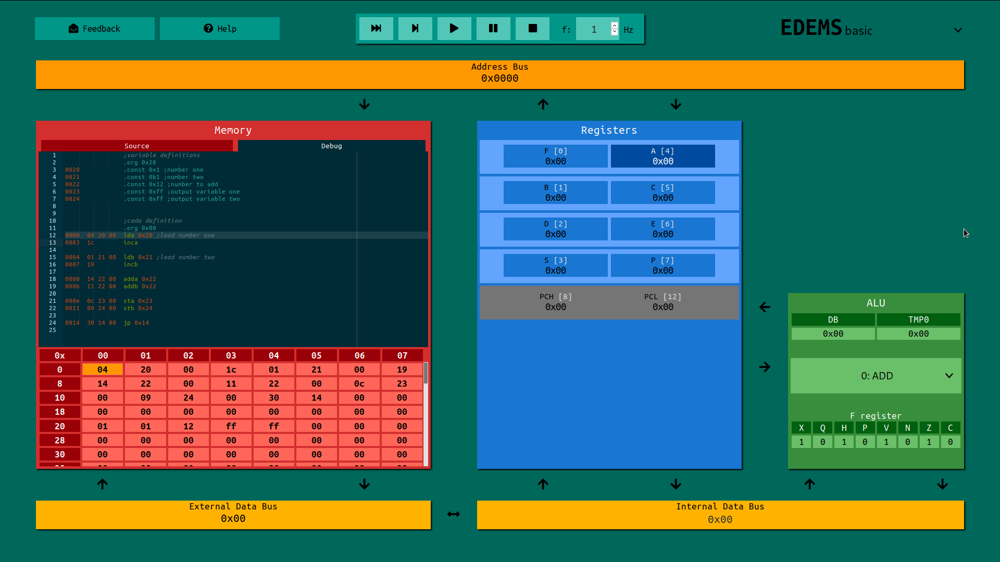
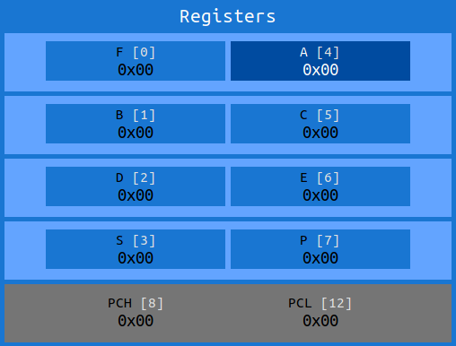
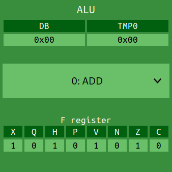
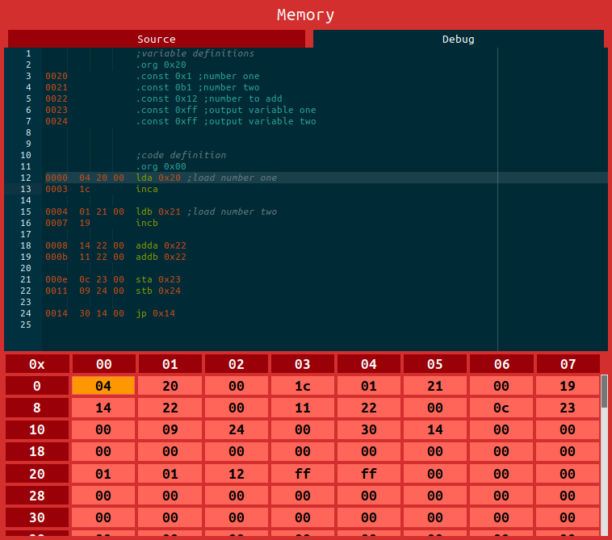
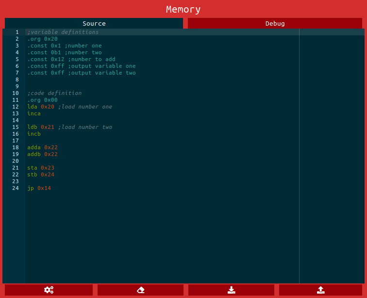

note: this file is deprecated. Update is on a way.
# EDEMS basic
Educational DEmonstrative Microprocessor Simulator, basic mod
 

## Clock


Function block of clock generator allows you to generate clock pulses.

Buttons from left to right do:

- instruction step (generate clock cycles, until a instruction is done)
- microinstruction step (generate one clock impulse)
- run (generate clock cycles until stopped
- pause (stop generating clock pulses)
- stop (stop generating clock pulses, set program counter to zero and load first instruction)
- frequency selector (value of clock pulses in Hz)

## basic registers
EDEMS has 8 basic registers. Basic means, they are visible to programmer. There is one exception, and that is program counter register pair, that is visible.



### A, B, C, D, E, S, P
Those registers can be used as general purpose 8b registers.

### BC, DE, SP
Those 8b register pairs can be used as general purpose 16b registers.

### PCH, PCL
Program counter of microprocessor. Though not addressable for user, is visible and editable using jump instructions.

### F register
F register contains ALU flags. Those are:

|  X  |  Q  |  H  |  P  |  V  |  N  |  Z  |  C  |
|-----|-----|-----|-----|-----|-----|-----|-----|
|F[7] |F[6] |F[5] |F[4] |F[3] |F[2] |F[1] |F[0] |

#### C - carry
Carry bit is set to one if last operation resulted with carry out = 1.

#### Z - zero
Zero bit is set, if result of last operation is zero.

#### N - Negative
Negative bit is set, if result of last operation has 1 as MSB, meaning number is negative in two's complement

#### V - Two's complement overflow
Two's complement overflow is set if the overflow occured in last operation. Theese two rules defines overflow.
- If the sum of two positive numbers yields a negative result, the sum has overflowed. 
- If the sum of two negative numbers yields a positive result, the sum has overflowed. 

#### P - Parity
Parity bit is set, if sum of ones in operation result is odd.

#### H - Half carry
Half carry is set, when carry out from thirth to fourth bit is 1. 

#### Q 
Not operated by ALU, usage defined by instruction set. Default instruction set does not use this bit.

#### X
Not operated by ALU, usage defined by instruction set. Default instruction set does not use this bit.

## ALU


Arithmetic-logic unit has 2 inputs and 2 outputs. Inputs are operands. Those are data bus and register TMP0 (special register edited by microinstructions). Outputs are data bus and register F. This is special register described in registers chapter. 

Operations use data bus and register TMP0 (special register edited by microinstructions) as its input. Data bus is used as output. Overflow is written to C flag of F register. Other flags of F are modified too according to table of operations. C flag of F register is used as input for some operations.

### Operations

| name | number | operation description                               | X           | Q           | H           | P           | V           | N           | Z           | C           |
|------|--------|-----------------------------------------------------|-------------|-------------|-------------|-------------|-------------|-------------|-------------|-------------| 
|ADD   |0       | **ADD** numbers: DB = DB + TMP                      | -           | -           |&updownarrow;|&updownarrow;|&updownarrow;|&updownarrow;|&updownarrow;|&updownarrow;|
|SUB   |1       | **SUB**stract: DB = TwosComplement(DB) + TMP        | -           | -           |&updownarrow;|&updownarrow;|&updownarrow;|&updownarrow;|&updownarrow;|&updownarrow;|
|NEG   |2       | create **NEG**ative number: DB = TwosComplement(DB) | -           | -           | -           |&updownarrow;| -           |&updownarrow;|&updownarrow;| -           |
|NOT   |3       | bitwise **NOT** bits: DB = ~DB                      | -           | -           | -           |&updownarrow;| -           |&updownarrow;|&updownarrow;| -           |
|AND   |4       | bitwise **AND** bits: DB = DB && TMP                | -           | -           | -           |&updownarrow;| -           |&updownarrow;|&updownarrow;| -           |
|ORR   |5       | bitwise **OR** bits: DB = DB &#124;&#124; TMP       | -           | -           | -           |&updownarrow;| -           |&updownarrow;|&updownarrow;| -           |
|XOR   |6       | bitwise **XOR** bits: DB = DB ^ TMP                 | -           | -           | -           |&updownarrow;| -           |&updownarrow;|&updownarrow;| -           |
|SHR   |7       | **SH**ift **R**ight DB                              | -           | -           | -           |&updownarrow;| -           |&updownarrow;|&updownarrow;| -           |
|SHL   |8       | **SH**ift **L**eft                                  | -           | -           | -           |&updownarrow;| -           |&updownarrow;|&updownarrow;| -           |
|ROR   |9       | **RO**tate **R**ight DB                             | -           | -           | -           |&updownarrow;| -           |&updownarrow;|&updownarrow;| -           |
|ROL   |10      | **RO**tate **L**eft                                 | -           | -           | -           |&updownarrow;| -           |&updownarrow;|&updownarrow;| -           |
|RCR   |11      | **R**otate **R**ight through **C**arry DB           | -           | -           | -           |&updownarrow;| -           |&updownarrow;|&updownarrow;|&updownarrow;|
|RCL   |12      | **R**otate **L**eft through **C**arry               | -           | -           | -           |&updownarrow;| -           |&updownarrow;|&updownarrow;|&updownarrow;|
|ASR   |13      | **A**rithmetic **S**hift **R**ight                  | -           | -           | -           |&updownarrow;| -           |&updownarrow;|&updownarrow;| -           |
|ASL   |14      | **A**rithmetic **S**hift **L**eft                   | -           | -           | -           |&updownarrow;| -           |&updownarrow;|&updownarrow;| -           |
|BSR   |15      | **B**CD **S**hift **R**ight                         | -           | -           | -           |&updownarrow;| -           |&updownarrow;|&updownarrow;| -           |
|BSL   |16      | **B**CD **S**hift **L**eft                          | -           | -           | -           |&updownarrow;| -           |&updownarrow;|&updownarrow;| -           |
|EQU   |17      | compare if **EQU**al to zero: DB = DB == 0          | -           | -           | -           |&updownarrow;| -           |&updownarrow;|&updownarrow;| -           |
|OOP   |18      | Do **O**peration defined by **OP** register.        | -           | -           | -           |&updownarrow;| -           |&updownarrow;|&updownarrow;| -           |

## Memory block
Memory block is graphical representation of 65kB memory. It has two view tabs. One tab for viewing memory and debugging written code and the second for editing source code. 

### Debug tab

The editor is ineditable, and shows listing of source code. The memory view is ineditable too and shows 8bit blocks of memory.

#### Listing
First collumn of listing output is address of first value of code. Second, third and fourth columns are values being stored in memory. Selected line represents actual program counter position.

### Source tab

Source tab allows editing source code, compiling it and writing it to memory, erasing memory, saving and loading source code.

Editor allows you to write source code, that can be compiled and written to memory. Syntax of source code is described in EDEMS assembly chapter.

Button operations from left to right:
- compile code and write it to memory
- erase memory
- save source code
- load source code

#### EDEMS assembly syntax
EDEMS assembly is simpler version of assembly. It supports four types of code sections - instructions, pseudoinstructions, constants and comments. EDEMS assembly is case insensitive.

##### Instructions
Instructions are defined by microcode. Simulator comes with default instruction set:

|mnemonic  | argument |cycles| operation description                    |
|----------|----------|------|------------------------------------|
|LD{reg}   | address  | 14   |**l**oa**d** from  address to register.|
|ST{reg}   | address  | 14   |**st**ore from  register to  address.|
|ADD{reg}  | address  | 17   |**add**  value from  address to  register. (result saved in the register)|
|INC{reg}  | none     | 4    |**inc**rement  register.|
|INC{reg\*}| none     | 4    |**inc**rement  register pair.|
|DEC{reg}  | none     | 4    |**dec**rement  register.|
|DEC{reg\*}| none     | 4    |**dec**rement  register pair.|
|JP        | address  | 12   |**j**u**mp** to address.|
|JPF{flag} | address  | 6-15 |**j**um**p** to address **i**f flag is zero.|
|JP{reg}   | address  | 6-15 |**j**um**p** to address **i**f register is zero.|
|SUB{reg}  | address  | 17   |**sub**tract  value from  address to  register. (result saved in the register)|
|AND{reg}  | address  | 17   |logical **and** operation of value from address and register. (result saved in the register)|
|OR{reg}   | address  | 17   |logical **or** operation of value from address and register. (result saved in the register)|
|XOR{reg}  | address  | 17   |logical **xor** operation of value from address and register. (result saved in the register)|

statements must be written in following format:
```
mnemonic   [operands]   [;comment]
```
##### Pseudoinstructions
Pseudoinstructions are instructions for compiler. There are two pseudoinstructions supported by EDEMS assembly:
- `.ORG [16b constant]` set offset of code from zero.
- `.CONST [8b constant]` store constant to memory.

##### Constants
Constants can be in three formats:
- Binary format `0b10010`
- Hexadecimal format `0x12`
- Decimal format `18`

##### Comments
Comment is considered everything afer sign `;` until end of line.


# EDEMS advanced
Advanced view of simulation of EDEM processor. This view allows to inspect function of microprocessor on microarchitecture level. Since this is just expanded basic mod, most of the informations about basic mod applies to advanced too.

## Registers
There are 6 more registers visible in advanced view.


### TMP0, TMP1, TMP2
General purpose registers for microcode.

### TMP1TMP2
register pair can be used as general purpose 16b register for microcode.

### OP 
Register for addressing of other registers. Most of the microinstruction use this register as pointer to another one.

### PCH, PCL
Program counter of microprocessor is now accesible.

### UPCL, UPCH
High and low bits of microprogram counter. Since microprogram addresses are only 11b, 5MSB of uPCH is not used.

Rewriting only one of the registers is not recomanded, since you would jump to another part of microprogram. For jump you should use     JMP instruction.


## Control unit
In advanced mod, there is a visible advanced unit block. This block represents microprogram memory, decoder and instruction register. 

Instruction register holds opcode of instruction being executed. All source and debug tab informations are same with memory source and debug informations, except microcode must be written in EDEMS micro assembly language.

### EDEMS micro assembly syntax
EDEMS micro assembly is simpler version of assembly. It supports five types of code sections - instructions, pseudoinstructions, constants, registers and comments. EDEMS assembly is case insensitive.

#### Microinstructions
//TODO: popsat mikroinstrukce a vylepšit tabulku 
This table explains whole microinstruction set. Microinstruction is an 12bit long number. This number is result of adding opcode base (for DB\<R it is 0x7C0) with "operand". This operand is usually 

| Mnemonic         | Opcode        | Operand | Function description                                                                                                                 |
|------------------|---------------|---------|--------------------------------------------------------------------------------------------------------------------------------------|
| DB \textless C   | 0x500         | 8b      | move operand as **C**onstant to **DB**                                                                                               |
| DB \textless R   | 0x7C0         | 4b      | move value from **R**egister defined by operand to **D**ata **B**uss.                                                                |
| AB \textless R   | 0x7B0         | 4b      | move value from **R**egister defined by operand to 8 least significant bits of **A**ddress **B**uss, nulling 8MSB.                   |
| AB \textless W   | 0x7A0         | 4b      | move **W**ord value (16b) from register pair defined by address of high register of pair defined by operand to **A**ddress **B**uss. |
| DB\textgreater R | 0x790         | 4b      | move value from **D**ata **B**us to **R**egister.                                                                                    |
| AB\textgreater W | 0x780         | 4b      | move value from **A**ddress **B**us to **W**ord pair of register defined by operand. (address of high register of pair)              |
| DB  \textless O  | 0x7F0         |         | move value from **O**P to **DB**.                                                                                                    |
| DB\textgreater O | 0x7F1         |         | move value from **DB** to **O**P.                                                                                                    |
| SVR              | 0x100         | 4b, 4b  | **S**witch **V**alues in **R**egisters defined by first and second operands.                                                         |
| SVW              | 0x200         | 4b, 4b  | **S**witch **V**alues in **W**ord register pair defined by first and second operands. (address of high register of pair)             |
| ALU              | 0x000         | 5b      | **ALU** does operation defined by operand. For example 0x02 is SUB, because 2 is index of sub operation                              |
| SETB             | 0x300         | 4b, 4b  | **SET** **B**yte defined by first operand in register defined by second operand.                                                     |
| RETB             | 0x400         | 4b, 4b  | **R**es**ET** **B**yte defined by first operand in register defined by second operand.                                               |
| INCB             | 0x770         | 4b      | **INC**rement **B**yte value in register defined by operand.                                                                         |
| DECB             | 0x760         | 4b      | **DEC**rement **B**yte value in register defined by operand.                                                                         |
| INCW             | 0x750         | 4b      | **INC**rement **W**ord value in register defined by operand. (address of high register of pair)                                      |
| DECW             | 0x740         | 4b      | **DEC**rement **W**ord value in register defined by operand. (address of high register of pair)                                      |
| READ             | 0x7F4         |         | **READ** from memory.                                                                                                                |
| WRT              | 0x7F5         |         | **WR**i**T**e to memory.                                                                                                             |
| JOI              | 0x730         | 4b      | **J**ump **O**ver next microinstruction if value in register defined by operand **I**s 0x00.                                         |
| JON              | 0x720         | 4b      | **J**ump **O**ver next microinstruction if value in register defined by operand is **N**ot 0x00.                                     |
| JOFI             | 0x710         | 4b      | **J**ump **O**ver next microinstruction if value in F[operand] **I**s 0b. uO acts as normal register for this microinstruction.      |
| JOFN             | 0x700         | 4b      | **J**ump **O**ver next microinstruction if value in F[operand] is **N**ot 0b. uO acts as normal register for this microinstruction.  |
| JMP              | 0x800         | 11b     | write operand to uPC, effectively **J**u**MP**ing in microcode. opcode is 0x800 + address                                            |
| COOP             | 0x600         | 8b      | **CO**unt **OP** register value. OP=IR-o1.                                                                                           |
| END              | 0x7F2         |         | **End** of instruction. Signal for control unit to load another instruction. This is done by incrementing PC, and loading value from memory addressed by PC to IR and UPC. |

statements must be written in following format:
```
mnemonic   [operands]   [;comment]
```
#### Pseudoinstructions
Pseudoinstructions are instructions for compiler. There are two pseudoinstructions supported by EDEMS micro assembly:

##### `.DEF`
This pseudo-microinstruction is used to define instructions. It has up to three arguments. First argument is address of first microinstruction of instruction, second argument is name of instruction and third is optional, defining how many bytes of argument the instruction takes. It is translated as jump to address of first microinstruction.

#### Constants
Constants can be in three formats:
- Binary format `0b10010`
- Hexadecimal format `0x12`
- Decimal format `18`

#### Comments
Comment is considered everything afer sign `;` until end of line.

#### Registers
Most of operands are registers. To make code more readable, you use its names instead of index. When pointing to simple register, you can use its name. When pointing to register pair, you have some options.

- FA - `FA`, `F`
- BC - `BC`, `B`
- DE - `DE`, `D`
- SP - `SP`, `S`
- PCHPCL - `PCHPCL`, `PCH`, `PC`
- TMP0OP - `TMP0OP`, `TMP0`, `TMPOP` 
- TMP1TMP2 - `TMP1TMP2`, `TMP1`, `TMP`
- UPCHUPCL - `UPCHUPCL`, `UPCH`, `UPC`


## Microinstruction buttons
