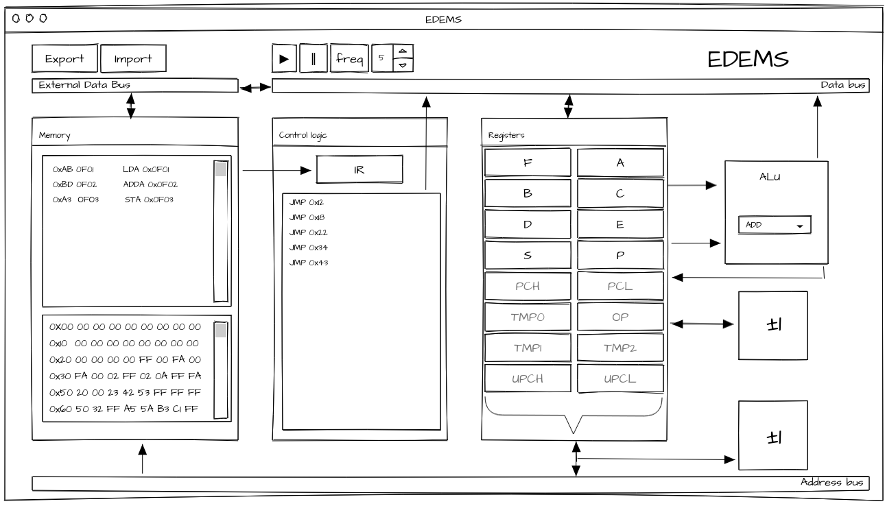

note: this file is deprecated. Update is on a way.
# EDEMS
Educational DEmonstrative Microprocessor Simulator



## EDEMS  registers
EDEMS has 16 registers, two of those are 16b, others are 8b. User reachable are 8 registers.

| #   | ------------ | #   | ------------ |
|-----|--------------|-----|--------------|
| R00 | F            | R04 | A            |
| R01 | B            | R05 | C            |
| R02 | D            | R06 | E            |
| R03 | S            | R07 | P            |
| R08 | PCH          | R12 | PCL          |
| R09 | TMP0         | R13 | OP           |
| R10 | TMP1         | R14 | TMP2         |
| R11 | UPCH         | R15 | UPCL         |

Registers 0-7 are user-addressable registers, 8-15 are microcode-only-addressable registers.


All registers, except PC(Program Counter) could theoretically be used as general purpose registers, but some bytes of F(flags) is rewrited after almost every ALU operation. SP is used by stack pointer instructions.

### A, B, C, D, E, S, P
Those registers can be used as general purpose 8b registers.

### BC, DE, SP
Those 8b register pairs can be used as general purpose 16b registers.

### TMP0, TMP1, TMP2
General purpose registers for microcode. 

### TMP1TMP2
register pair can be used as general purpose 16b register for microcode.

### OP 
Register for addressing of other registers.

### PCH, PCL
Program counter of microprocessor. Though not addressable for user, is visible and editable using jump instructions.

### UPCL, UPCH
High and low bits of microprogram counter. Since microprogram addresses are only 11b, 5MSB of uPCH is not used.

Rewriting only one of the registers is not recomanded, since you would jump to another part of microprogram. For jump you should use JMP instruction.

UPCH

|uPCH[7] |uPCH[6] |uPCH[5] |uPCH[4] |uPCH[3] |uPCH[2] |uPCH[1] |uPCH[0]|
|--------|--------|--------|--------|--------|--------|--------|-------|
|NA      |NA      |NA      |NA      |NA      | uPC[10]| uPC[9] | uPC[8]|

UPCL

|uPCL[7] |uPCL[6] |uPCL[5] |uPCL[4] |uPCL[3] |uPCL[2] |uPCL[1] |uPCL[0]|
|--------|--------|--------|--------|--------|--------|--------|-------|
|uPC[7]  |uPC[6]  |uPC[5]  |uPC[4]  |uPC[3]  |uPC[2]  |uPC[1]  |uPC[0] |

### F register
F register contains ALU flags. Those are:

|  X  |  Q  |  H  |  P  |  V  |  N  |  Z  |  C  |
|-----|-----|-----|-----|-----|-----|-----|-----|
|F[7] |F[6] |F[5] |F[4] |F[3] |F[2] |F[1] |F[0] |

- C - carry
- Z - zero
- N - Negative
- V - Two's complement overflow
- P - Parity (1 if parity odd)
- H - Half carry
- Q - Sticky bit 
- X - not operated by ALU, usage defined by instruction set/user.

## ALU
```
                           
 |F[C]| |DB|     |TMP0| 
   |     |        |   
   V     V        |
  |  MUX  |       |
      |           |
      V           V   
  \---------\   /----/ 
   \         \ /    /  
    \              /---->|F|
     \    ALU     /    
      \----------/     
        |    |  
        |    |  
        V    V               
     |F[C]| |DB|
```

ALU has 2 inputs and 3 outputs. Operations use data bus as its output, overflow is written to C flag of F register. Other flags of F are modified too. C flag of F register can be used as input too.

### Operations

| name | number | operation description                               |
|------|--------|-----------------------------------------------------|
|ADD   |0       | **ADD** numbers: DB = DB + TMP                      |
|SUB   |1       | **SUB**stract: DB = TwosComplement(DB) + TMP        |
|NEG   |2       | create **NEG**ative number: DB = TwosComplement(DB) |
|NOT   |3       | bitwise **NOT** bits: DB = ~DB                      |
|AND   |4       | bitwise **AND** bits: DB = DB && TMP                |
|ORR   |5       | bitwise **OR** bits: DB = DB &#124;&#124; TMP       |
|XOR   |6       | bitwise **XOR** bits: DB = DB ^ TMP                 |
|SHR   |7       | **SH**ift **R**ight DB                              |
|SHL   |8       | **SH**ift **L**eft                                  |
|ROR   |9       | **RO**tate **R**ight DB                             |
|ROL   |10      | **RO**tate **L**eft                                 |
|RCR   |11      | **R**otate **R**ight through **C**arry DB           |
|RCL   |12      | **R**otate **L**eft through **C**arry               |
|ASR   |13      | **A**rithmetic **S**hift **R**ight                  |
|ASL   |14      | **A**rithmetic **S**hift **L**eft                   |
|BSR   |15      | **B**CD **S**hift **R**ight                         |
|BSL   |16      | **B**CD **S**hift **L**eft                          |
|EQU   |17      | compare if **EQU**al to zero: DB = DB == 0          |
|OOP   |18      | Do **O**peration defined by **OP** register.        |


## uInstructon set
uInstructions are 2B wide. Opcode usually is 12b with 1 4b operad, but there are some exceptions (JMP is 4b opcode with 11b operand). OP register is addressing register. When used in most microinstructions, containing value is used as address of another register instead.

O is operand, and number next to it says how many bits it takes. For example `COOP` instruction is 8bit opcode and 8bit operand.

| name             | opcode | operation description                    |
|------------------|--------|------------------------------------------|
| `COOP + O8`      | 0x6?? | **CO**unt **OP** register value. OP=IR-o1. |
| `ALU + O5`       | 0x0?? | **ALU** does operation defined by operand. For example 0x01 is ADD, 0X02 is SUB,... |
| `R>DB + O4`      | 0x7C? | move value from **R**egister defined by operand to **D**ata **B**uss. |
| `R>AB + O4`      | 0x7B? | move value from **R**egister defined by operand to 8 least significant bits of **A**ddress **B**uss, nulling 8MSB. |
| `W>AB + O4`      | 0x7A? | move **W**ord value (16b) from register pair defined by address of high register of pair defined by operand to **A**ddress **B**uss. |
| `DB>R + O4`      | 0x79? | move value from **D**ata **B**us to **R**egister. |
| `AB>W + O4`      | 0x78? | move value from **A**ddress **B**us to **W**ord pair of register defined by operand. (address of high register of pair) |
| `INCB + O4`      | 0x77? | **INC**rement **B**yte value in register defined by operand. |
| `DECB + O4`      | 0x76? | **DEC**rement **B**yte value in register defined by operand. |
| `INCW + O4`      | 0x75? | **INC**rement **W**ord value in register defined by operand. (address of high register of pair)  |
| `DECW + O4`      | 0x74? | **DEC**rement **W**ord value in register defined by operand. (address of high register of pair)  |
| `JOI + O4`       | 0x73? | **J**ump **O**ver next microinstruction if value in register defined by operand **I**s 0x00. |
| `JON + O4`       | 0x72? | **J**ump **O**ver next microinstruction if value in register defined by operand is **N**ot 0x00. |
| `JOFI + O4`      | 0x71? | **J**ump **O**ver next microinstruction if value in F[operand] **I**s 0b. uO acts as normal register for this microinstruction. |
| `JOFN + O4`      | 0x70? | **J**ump **O**ver next microinstruction if value in F[operand] is **N**ot 0b. uO acts as normal register for this microinstruction. |
| `C>DB + O8`      | 0x5?? | move operand as **C**onstant to **DB** |
| `SVR + O4 + O4`  | 0x1?? | **S**witch **V**alues in **R**egisters defined by first and second operands. |
| `SVW + O4 + O4`  | 0x2?? | **S**witch **V**alues in **W**ord register pair defined by first and second operands. (address of high register of pair) |
| `O>DB`           | 0x7F0 | move value from **O**P to **DB**. |
| `DB>O`           | 0x7F1 | move value from **DB** to **O**P. |
| `END`            | 0x7F2 | **END** of microinstruction. Signal for control unit to fetch another instruction. |
| `JMP + O11`      | 0x??? | write operand to uPC, effectively **J**u**MP**ing in microcode. opcode is 0x800 + address|
| `READ`           | 0x7F4 | **READ** from memory. |
| `WRT`            | 0x7F5 | **WR**i**T**e to memory. |
| `SETB + O4 + O4` | 0x3?? | **SET** **B**yte defined by first operand in register defined by second operand. |
| `RETB + O4 + O4` | 0X4?? |  **R**es**ET** **B**yte defined by first operand in register defined by second operand. |

## brainfuck
used registers:

- HL1 - Data pointer, initial value = `0x0010`
- SP - Output pointer, initial value = `0xFFFF`
- OP1 - Parenthesis counter, initial value = `0x00`

### Initial memory map
All of memory is filled with `0x00`

```
*********** - BC - IP(input pointer) - 0x0000
*         *
*         *
*********** - DE - DP(data pointer) - 0x0010
*         *
*         *
*         *
*         *
*         *
*         *
    ...
*         *
*         *
*********** - SP - OP(output pointer) - 0xFFFF
```
### Instructions
-  `>` - 0x3E Increment the data pointer (to point to the next cell to the right).
-  `<` - 0x3C Decrement the data pointer (to point to the next cell to the left).
-  `+` - 0x2B Increment (increase by one) the byte at the data pointer.
-  `-` - 0x2D Decrement (decrease by one) the byte at the data pointer.
-  `*` - 0x2A Output the byte at the data pointer.
-  `,` - 0x2C Accept one byte of input, storing its value in the byte at the data pointer.
-  `[` - 0x5B If the byte at the data pointer is zero, then instead of moving the instruction pointer forward to the next command, jump it forward to the command after the matching ] command.
-  `]` - 0x5D If the byte at the data pointer is nonzero, then instead of moving the instruction pointer forward to the next command, jump it back to the command after the matching [ command.
- unknown - Any unknown opcode is skipped.

## minimal instruction set

Instructions use two, one or zero operands. Microcode can operate with "microoperands" that opcodes has coded inside. For example: 
LD loads 8b value from 16b address. Its definition is `|LDa16  (3b) where| + |addrH| + |addrL|`. every `| |` block means 8bit value. This means that this operation has 8b opcode and two 8b operands. The last 3 bits of opcode defines save location of load action (000b - B, 111b - F, 101b - P).

### instructions
- `|LD 3b where| + |addrH| + |addrL|` - **l**oa**d** from 2B address to 8 bit register.
- `|ST 3b what| + |addrH| + |addrL|` - **st**ore from 1B register to 2B address.
- `|ADD 3b where| + |addrH| + |addrL|` - **add** 1B value from 2B address to 1B register. (result saved in the register)
- `|ADD 2b where| + |addrH| + |addrL|` - **add** 1B value from 2B address to 2B register. (result saved in the register)
- `|INCW 2b what|` - **inc**rement 2B register.
- `|INC 3b what|` - **inc**rement 1B register.
- `|DECW 2b what|` - **dec**rement 2B register.
- `|DEC 3b what|` - **dec**rement 1B register.
- `|TST| + |addrH| + |addrL|` - **t**e**st** if value on 2B address is zero, next instruction is skipped.
- `|TSTF 3b which|` - **t**e**st** if nth bit of **F** register is zero, next instruction is skipped.
- `|JMP| + |where|` - relative **j**u**mp** to address. (operand is added to PC)

<!--

## complete instruction set

### instructions
- |LDa16 3b where| + |addrH| + |addrL| - load from 16b address to 8 bit register.
- |LDa8 3b where| + |addr|
- |STa16 3b what|
- |STa8 3b what|
- |ADDa16 3b where|
- |ADDa8 3b where|
- |INC16b 2b what|
- |INC8b 3b what|
- |DEC16b 2b what|
- |DEC8b 3b what|
- |TSTa16|
- |TSTa8|
- |TSTF 3b which|
- ...


keyword: "TSTFC", hex: "0x30", address: 48,  
keyword: "TST",   hex: "0x38", address: 56, operand: "2B" ,
keyword: "JMP",   hex: "0x39", address: 57,

-->
